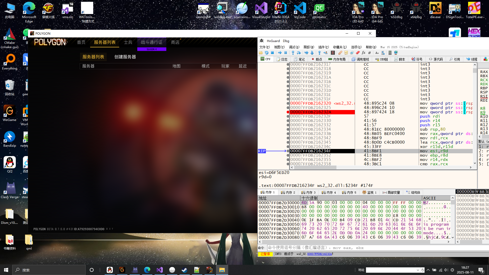
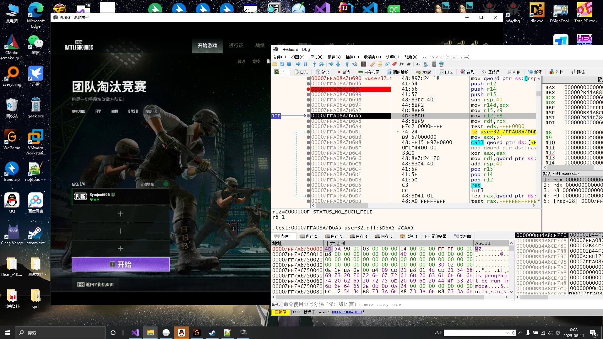

# HvGuardDbg 工具说明

## 主要功能
- **虚拟化保护**：基于 **VMX / EPT** 的内存访问控制  
- **调试器防护**：隐藏硬件断点、软件断点、异常过滤等  
- **反反调试**：对抗游戏环境中的 **EAC**、**BattleEye** 检测机制  
- **动态策略控制**：通过 `HvInterface.dll` 导出 API 控制所有行为

默认启用：
   - 隐藏调试断点  
   - VEH/UEF 异常绕过  
   - EPT 内存访问控制  
   - 调试窗口行为保护 

